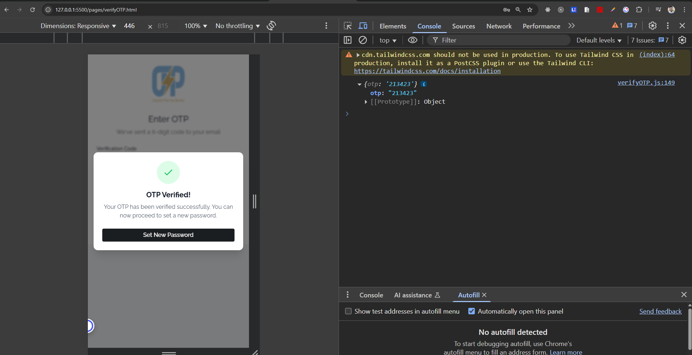

# OPE Multi-Step Registration Form

A modern, responsive registration form for Oshakati Premier Electric (OPE) featuring multi-step navigation, real-time validation, and enhanced user experience.

 
## 🌐 Live Link
[https://roushan-sheik.github.io/armin-wieland/](https://roushan-sheik.github.io/armin-wieland/)


## 📁 File Structure
```
└─ .
   ├─ assets
   │  ├─ favicon.ico
   │  ├─ favicon.png
   │  └─ logo.png
   ├─ index.html
   ├─ pages
   │  ├─ forgotPassword.html
   │  ├─ login.html
   │  ├─ setPasswordPage.html
   │  └─ verifyOTP.html
   ├─ README.MD
   ├─ scripts
   │  ├─ forgotPassword.js
   │  ├─ login.js
   │  ├─ scripts.js
   │  ├─ setPasswordPage.js
   │  └─ verifyOTP.js
   ├─ styles
   │  └─ styles.css
   └─ tailwind.config.js

```
## 🚀 Features
### Multi-Step Process


## 📋 Files to Include

### HTML Files (Include in this order):
1. `index.html` - Main registration page
2. `pages/login.html` - Login page
3. `pages/forgotPassword.html` - Forgot password request page
4. `pages/verifyOTP.html` - OTP verification page
5. `pages/setPasswordPage.html` - Password reset page

### CSS Files:
1. `styles/styles.css` - Global OPE styles (must be included in all HTML files)

### JavaScript Files (Include respective file with each HTML page):
1. `scripts/scripts.js` - For index.html
2. `scripts/login.js` - For pages/login.html
3. `scripts/forgotPassword.js` - For pages/forgotPassword.html
4. `scripts/verifyOTP.js` - For pages/verifyOTP.html
5. `scripts/setPasswordPage.js` - For pages/setPasswordPage.html

### 🔄 Form Flow

This section explains how the authentication forms work and how to handle submissions.

- Form Submission

1. When a user submits any authentication form (login, forgot password, set password, verify OTP), the form data is collected.

2. Open the browser console (F12 → Console tab) to see the submitted form data logged.

### Script Integration

1. All form-related JavaScript files are located inside the scripts/ folder.

2. Each form has its own script file:

3. login.js → Handles Login form.

4. forgotPassword.js → Handles Forgot Password form.

5. setPasswordPage.js → Handles Set Password form.

6. verifyOTP.js → Handles Verify OTP form.

7. API Calls

8. After form validation, you can replace the console.log(formData) statement with an API call.

### Example (using fetch):

```js
fetch("https://your-api-endpoint.com/auth/login", {
  method: "POST",
  headers: {
    "Content-Type": "application/json"
  },
  body: JSON.stringify(formData)
})
.then(response => response.json())
.then(data => {
  console.log("API response:", data);
  // Handle success (e.g., redirect to dashboard)
})
.catch(error => {
  console.error("Error:", error);
  // Handle error (e.g., show error modal)
});
```

1. Registration (index.html) → Creates new account
  
2. Login (pages/login.html) → Access existing account
  
3. Forgot Password (pages/forgotPassword.html) → Request reset link
  
4. OTP Verification (pages/verifyOTP.html) → Verify identity
  
5. Set Password (pages/setPasswordPage.html) → Create new password
  

## 🔧 Dependencies

1. **Tailwind CSS** - Utility-first CSS framework
   - Include via CDN in HTML head:
   ```html
   <script src="https://cdn.tailwindcss.com"></script>